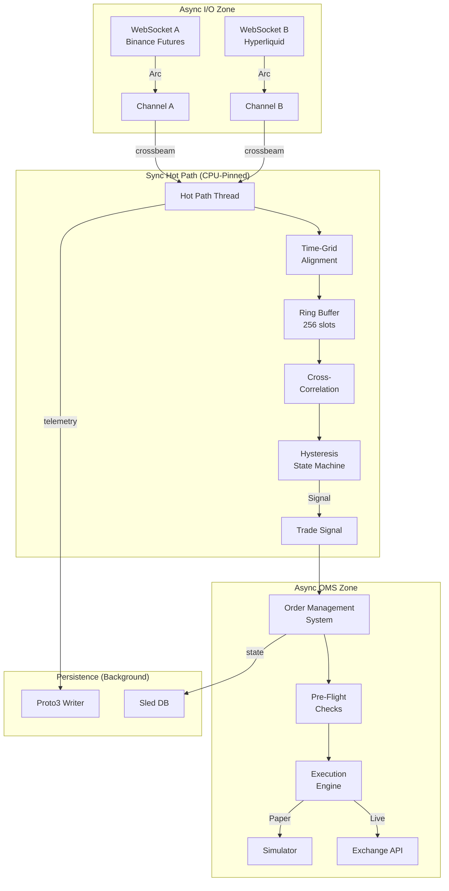

# TokioParasite — Lead-Lag Arbitrage Engine

## System Architecture



## Hardware Requirements

| Component | Specification | Rationale |
|-----------|---------------|-----------|
| **Compute** | AWS C7g (Graviton3) | ARM NEON SIMD for correlation |
| **Region** | ap-northeast-1 (Tokyo) | Lowest latency to Binance/Hyperliquid |
| **Network** | Starlink + Fiber failover | Redundant connectivity |
| **Power** | Solar + UPS | Off-grid resilience |
| **OS** | Amazon Linux 2023 | Kernel 6.1 with PREEMPT_RT |

## Environment Setup

```bash
# 1. Install Rust 1.75+
curl --proto '=https' --tlsv1.2 -sSf https://sh.rustup.rs | sh

# 2. Clone and build
git clone <repo-url> tokioparasite
cd tokioparasite
cargo build --release

# 3. Configure
cp settings.toml.example settings.toml
# Edit settings.toml with your API keys

# 4. Run
cargo run --release
```

## Quick Start — Lead-Lag Engine

```bash
# Paper trading mode (default)
cargo run --release

# With debug logging
RUST_LOG=tokioparasite=debug cargo run --release

# Run benchmarks
cargo bench

# Run all tests
cargo test
```

## Module Map

| Module | File | Purpose |
|--------|------|---------|
| `signal`  | `src/signal/`  | Hot path: correlation, hysteresis, ring buffer |
| `eal`     | `src/eal/`     | Exchange Abstraction Layer |
| `oms`     | `src/oms/`     | Order Management System + risk |
| `sim`     | `src/sim/`     | Paper trading simulator |
| `runners` | `src/runners/` | Isolated execution loops (Paper vs Live) |
| `persist` | `src/persist/` | Telemetry + state store |
| `config`  | `src/config/`  | Settings validation |

## Documentation Index

- [Architecture Overview](docs/architecture.md)
- [Strategy (Math & OBI Fusion)](docs/OVERVIEW.md)
- [Live Trading Workflow](docs/livetrading.md)
- [Configuration Guide](docs/modules/config.md)
- [Order Management (OMS)](docs/modules/oms.md)
- [Runners & Execution Modes](docs/modules/runners.md)
- [Simulator (Paper)](docs/modules/sim.md)
- [Telemetry (Proto3)](docs/modules/telemetry.md)

## Key Metrics

| Metric | Target | Measured |
|--------|--------|----------|
| Hot path latency | <10µs | ~3µs (criterion) |
| Correlation calc | <1µs | ~800ns |
| Ring buffer push | <100ns | ~50ns |
| Zero allocations | Yes | Verified (no Vec::push in hot path) |