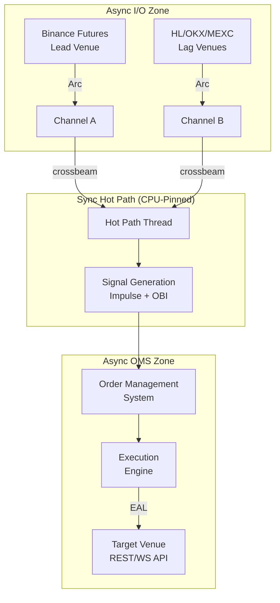

# TokioParasite — Lead-Lag Arbitrage Engine (v0.6.0)

## System Architecture

## Module Map

| Module | Purpose | Venues |
|--------|---------|--------|
| `eal` | Exchange Abstraction Layer | Binance, HL, OKX, MEXC |
| `runners` | Isolated execution loops | Paper, HL, OKX, MEXC |
| `signal` | Hot-path signal pipeline | Logic-unified |
| `oms` | Risk, CD, & Order routing | Unified gating |

## Documentation Index

- [**Architecture Overview**](docs/architecture.md) — Multi-exchange data flow.
- [**Runners & Execution Modes**](docs/modules/runners.md) — v0.6.0 runner model.
- [**Changelog**](docs/CHANGELOG.md) — Detailed version history.